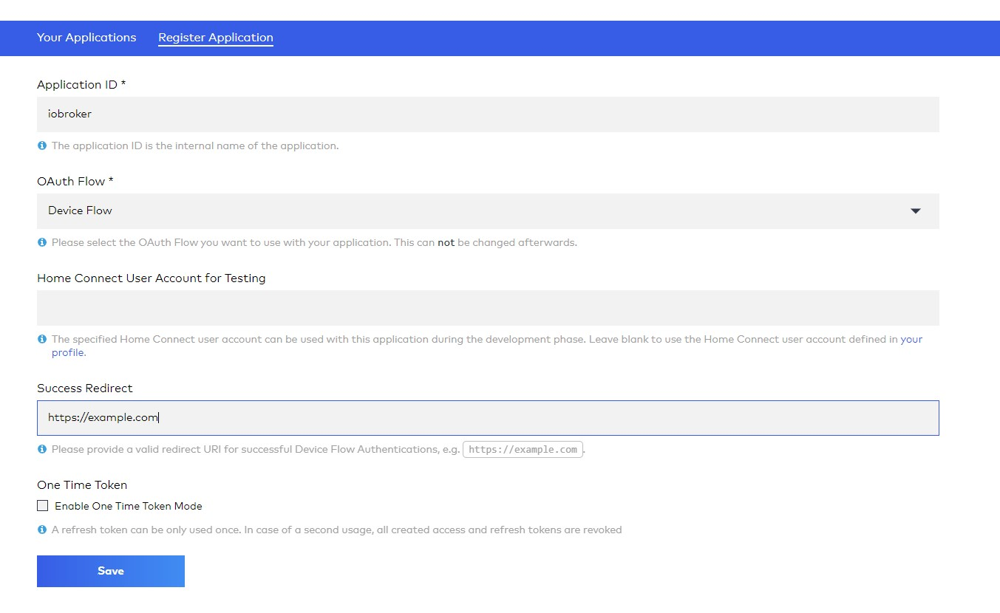

# ioBroker.homeconnect

## Voraussetzungen vor der Installation

Für den Adapter wird eine ClientID benötigt. Nutze die Einstellungen um jeden Schritt der Registrierung zu erreichen.

<https://developer.home-connect.com>


Bei **Default Home Connect User Account for Testing** die E-Mail-Adresse angeben, mit der die Home-Connect-App
registriert wurde, diese wird später auch beim Authorization-Prozess benötigt.


Bei **Account Type** Individual auswählen. Die restlichen Daten sofern vorhanden ergänzen (keine Ahnung, ob das geprüft wird).


Dann auf **Applications** und anschließend auf **Register Application** gehen.



Bei **Application ID** einen Namen für die Application eintragen, z.B. ioBroker. Bei **OAuth Flow** Device Flow selektieren.
**Home Connect User Account for Testing** kann leer bleiben. Bei **Success Redirect** eine URI eintragen, z.B. https://example.com.
Dann Speichern und dann hat man die benötigte ClientID.

## Konfiguration

In der Adapter-Config muss der Homeconnect App Benutzername und Passwort und die erstellte ClientID eingetragen werden.

## Benutzung

Mit den states in commands kannst du das Programm stoppen, pausieren oder fortführen.

Mit den states in settings kannst du das Gerät ein oder ausschalten.

Ändern des States programs.active.BSH_Common_Root_ActiveProgram führt zum starten eines Programms
Update iQ300: Es muss das gewüschnte Programm eingetragen werden. Wenn man programs.selected.BSH_Common_Root_SelectedProgram ausliest und einträgt, hat der User die Möglichkeit am Gerät des gewünschte Programm auszuwählen, welches dann per ioBroker gestartet wird.

Ändern des States programs.selected.BSH_Common_Root_SelectedProgram führt zum auswählen des Programms oder Optionen

Wenn man checken möchte, ob ein Programm fertig ist muss

status.BSH_Common_Status_OperationState

auf den kompletten Status Name übrprüft werden:

BSH.Common.EnumType.OperationState.Finished

Weitere Zustände sind noch:

"BSH.Common.EnumType.OperationState.Inactive": "Inactive",
"BSH.Common.EnumType.OperationState.Ready": "Ready",
"BSH.Common.EnumType.OperationState.Run": "Run",
"BSH.Common.EnumType.OperationState.ActionRequired": "ActionRequired",
"BSH.Common.EnumType.OperationState.Finished": "Finished"

Oder ob ein Gerät geöffnet ist

"BSH.Common.EnumType.DoorState.Open": "Open",
"BSH.Common.EnumType.DoorState.Closed": "Closed"

## Rate Limiting

[API Rate Limiting](https://api-docs.home-connect.com/general/#rate-limiting)

- 10 Event Monitoring pro Benutzer und Home Connect Account
  - nicht hinzugefügt
- 10 Abfragen pro Sekunde (hier kommt es noch auf die Datenmenge an)

  - nicht hinzugefügt

- 10 Tokenaktualisierung pro Minute
  - Wird nach 9 Request innerhalb einer Minute ausgelöst. Wird dann für 1 Minute gesperrt
- 109 Tokenaktualisierung pro Tag
  - Wird nach 99 Request innerhalb eines Tages ausgelöst. Wird dann bis Mitternacht gesperrt. Bin nicht sicher ob es nicht doch 24h sind

## homeconnect.0.rateTokenLimit.isBlocked

- true für Sperre und false für keine Sperre

## homeconnect.0.rateTokenLimit.limitJson

```JSON
{
  "tokenRefreshMinutesMax": 9, // Max Requests pro 10 Minuten
  "tokenRefreshMinutesCount": 0, // Zähler für max Requests pro 10 Minuten
  "tokenRefreshMinutesLast": 1754680202619, // Startzeit als Zeitstempel ab wann gezählt wird
  "tokenRefreshDayMax": 99, // Max Requests pro Tag
  "tokenRefreshDayCount": 2, // Zähler für max Requests pro Tag
  "tokenRefreshDayLast": 1754658108428, // Startzeit als Zeitstempel ab wann gezählt wird
  "tokenBlock": false, // True wenn eine Sperre aktive ist
  "tokenBlockTime": 0, // Zeitstempel wann die Sperre ausgelöst wurde
  "tokenReason": "No Block" // Name der Sperre (intern Adapter)
}
```

## homeconnect.0.rateTokenLimit.reason

```JSON
"states": {
    "0": "Nothing", // Keine Sperre
    "1": "Token Limit (10 per minute)", // 10 Minutensperre aktiv
    "2": "Token Limit (100 per day)" // 24h aktiv
}
```

- 10 requests pro Sekunde in Durchschnitt (Max 20 Requests zeitgleich)

  - Wird nach 15 Requests ausgelöst

- 1000 Anfragen pro Benutzer und Home-Connect Benutzerkonto pro Tag
  - Wird nach 9999 Request innerhalb eines Tages ausgelöst. Wird dann bis Mitternacht gesperrt. Bin nicht sicher ob es nicht doch 24h sind
- 50 Anfragen pro Benutzer und Home-Connect Benutzerkonto pro Minute

  - Wird nach 49 Request innerhalb einer Minute ausgelöst. Alle Abfragen werden für 1 Minute gesperrt.

- 5 Anfragen Start pro Benutzer und Home-Connect Benutzerkonto pro Minute

  - Wird nach 4 Request innerhalb einer Minute ausgelöst. Alle Abfragen werden für 1 Minute gesperrt.

- 5 Anfragen Stop pro Benutzer und Home-Connect Benutzerkonto pro Minute

  - Wird nach 4 Request innerhalb einer Minute ausgelöst. Alle Abfragen werden für 1 Minute gesperrt.

- 10 Fehlermeldung pro Benutzer und Home-Connect Benutzerkonto pro 10 Minuten.
  - Wird nach 9 Fehlermeldungen innerhalb einer 10 Minuten ausgelöst. Alle Abfragen werden für 10 Minute gesperrt.

## homeconnect.0.rateLimit.isBlocked

- true für Sperre und false für keine Sperre

## homeconnect.0.rateLimit.limitJson

```JSON
{
  "requestsMinutesMax": 49, // Max Requests pro Minute
  "requestsMinutesCount": 0, // Zähler für max Requests pro Minute
  "requestsMinutesLast": 1754680202594, // Startzeit als Zeitstempel ab wann gezählt wird
  "requestsDayMax": 999, // Max Requests pro Tag
  "requestsDayCount": 21, // Zähler für max Requests pro Tag
  "requestsDayLast": 0, // Startzeit als Zeitstempel ab wann gezählt wird
  "requestsMinutesStartMax": 4, // Max Start Requests pro Minute
  "requestsMinutesStartCount": 0, // Zähler für Start Requests pro Minute
  "requestsMinutesStartLast": 1754680202594, // Startzeit als Zeitstempel ab wann gezählt wird
  "requestsMinutesStopMax": 4, // Max Stop Requests pro Minute
  "requestsMinutesStopCount": 0, // Zähler für Stop Requests pro Minute
  "requestsMinutesStopLast": 1754680202594, // Startzeit als Zeitstempel ab wann gezählt wird
  "responseErrorLast10MinutesMax": 9, // Max Requests pro 10 Minuten
  "responseErrorLast10MinutesCount": 2, // Zähler für max Requests pro 10 Minuten
  "responseErrorLast10MinutesLast": 1754680143652, // Startzeit als Zeitstempel ab wann gezählt wird
  "requestBlock": false, // True wenn eine Sperre aktive ist
  "requestBlockTime": 0, // Zeitstempel wann die Sperre ausgelöst wurde
  "requestReason": "No Block", // Name der Sperre (intern Adapter)
  "requests": [ // Alle Abfragen pro Tag
    {
      "methode": "GET", // Methode
      "haId": "0000", // Seriennummer
      "url": "/status", // URL
      "date": "2025-08-14T18:46:17.535Z" // Zeit
    },
    {
      "methode": "GET",
      "haId": "015030396331009276",
      "url": "/settings",
      "date": "2025-08-14T18:46:17.536Z"
    },
  ],
}
```

## homeconnect.0.rateLimit.reason

```JSON
"states": {
    "0": "Nothing", // Keine Sperre
    "1": "Error Limit (10 per 10 minutes)", // Error Sperre für 10 Minuten aktiv
    "2": "Start Limit (5 per minute)", // Start Sperre für 1 Minute aktiv
    "3": "Stop Limit (5 per minute)", // Stop Sperre für 1 Minute aktiv
    "4": "Request Limit (50 per minute)", // Sperre für 1 Minute aktiv
    "5": "Request Limit (1000 per day)" // Sperre ein Tag aktiv
}
```
